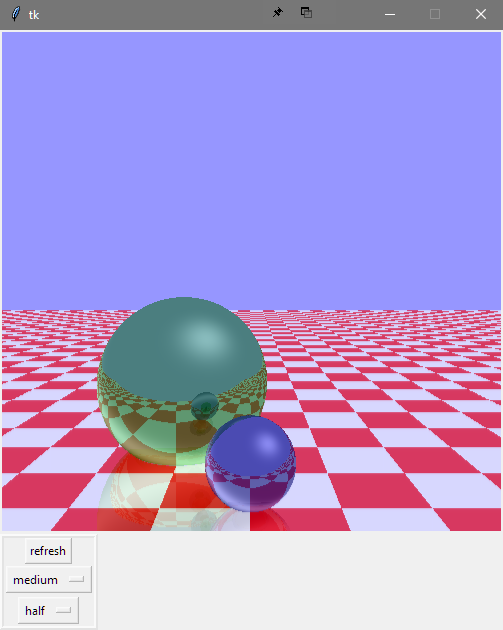

# Advanced Lighting Model
Model that creates the classic image of reflective spheres on a checkerboard using recursive ray-tracing, point lighting, and Phong shading. 

*This school project required the used of TKinter and nothing else. Even use of numpy was forbidden. Every pixel was required to be a rectangle object scaled to as small as possible on a canvas, and matrix manipulation and linear alegbra were done manually. As such, this program is nearly exponentially slower the more "pixels" are being rendered. I wish it wasn't so, but it is what it is.*

*This program renders a full image, so it runs RIDICULOUSLY slow. There isn't a way around this, as the hurdle is inherent in the required implementation*

**If you decide to run this program, I am not responsible for your computer slowing down until the image is rendered.**

  

Ryan Walters
  Louisiana Tech University
  2/22/17

  Ray Tracing program that recursively calculates color reflections of a checkerboard with two highly-reflective
  colored spheres. The checkerboard is also reflective. Objects also are lit and shaded using Phong shading with
  specular highlights
